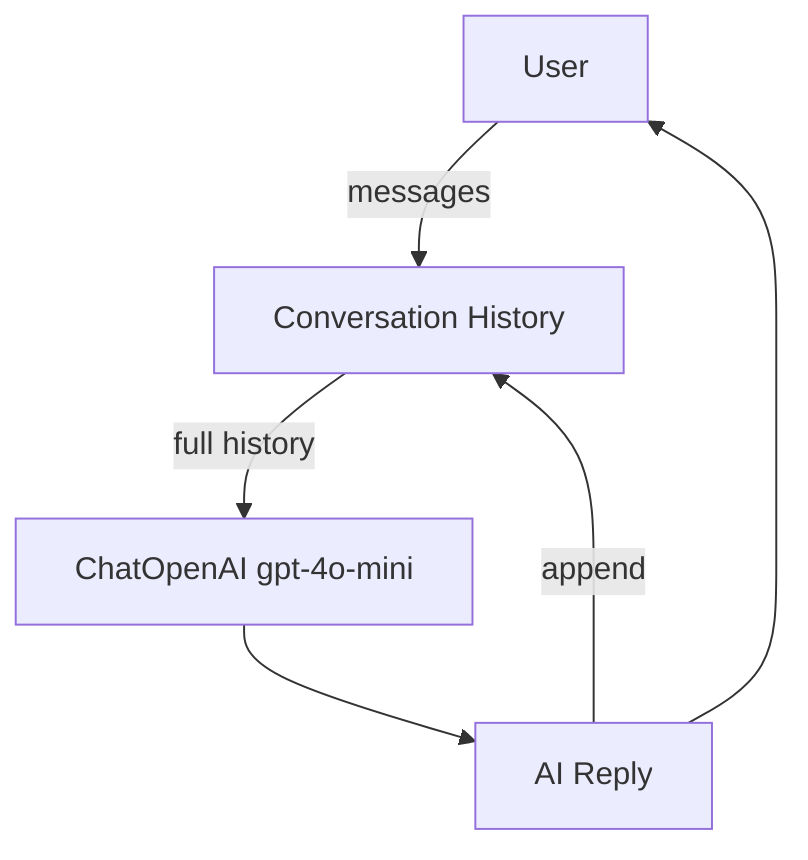
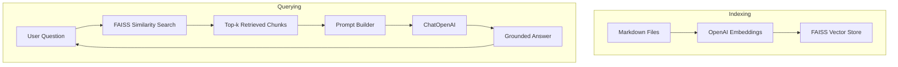

# LangChain LLM Demo


A small but powerful Python project demonstrating how to:

- Load environment variables with `python-dotenv`
- Call OpenAI’s models using **LangChain**
- Print model responses and token usage
- Estimate API cost for each call
- Run an **interactive chatbot with in-session memory**
- Perform **Retrieval-Augmented Generation (RAG)** over local documents
- Structure a simple, reproducible LLM project

It’s an ideal starting point for learning how LangChain and the OpenAI API work together.

---

## 🚀 Getting Started

Follow these steps to run the project from scratch on any machine.

---

### 1. Install Python 3.10+ (if needed)

Download from:  
https://www.python.org/downloads/

Make sure to check:

✔ **“Add Python to PATH”**

---

### 2. Clone the repository

```bash
git clone https://github.com/drzaheerabhatti-tech/langchain-llm-demo.git
cd langchain-llm-demo
```

---

### 3. Create and activate a virtual environment

#### Windows (PowerShell):

```bash
python -m venv venv
.\venv\Scripts\activate
```

#### macOS / Linux:

```bash
python3 -m venv venv
source venv/bin/activate
```

When active, your terminal will show:

```
(venv)
```

---

### 4. Install project dependencies

```bash
pip install -r requirements.txt
```

---

### 5. Get an OpenAI API Key

#### 5.1 Sign in to OpenAI

https://platform.openai.com/

#### 5.2 Create a secret API key

Go to:  
**Dashboard → API Keys → Create new secret key**

Copy your key, for example:

```
sk-xxxxxxxxxxxxxxxxxxxxxxxxxxxxxxxx
```

> Keep it private — **never commit it to GitHub**.

#### 5.3 Create a `.env` file

```env
OPENAI_API_KEY=sk-your-real-key-here
```

Git ignores this file automatically.

---

## 6. Basic LLM Demo (`llm.py`)

Run:

```bash
python llm.py
```

Example output:

```
REPLY: Solace PubSub+ is a high-performance event streaming and messaging platform.
USAGE: {'input_tokens': 12, 'output_tokens': 16, 'total_tokens': 28}
Estimated cost for this call: $0.00001234
```

---

# 💬 Chatbot with In-Session Memory (`llm_prompt.py`)

A simple chatbot that remembers your conversation *during the session*:

- Tracks history
- Uses `SystemMessage`, `HumanMessage`, `AIMessage`
- Shows token usage + cost
- Runs until you type `exit` or `quit`

---

## ▶️ Run the chatbot

```bash
python llm_prompt.py
```

You’ll see:

```
💬 Mini Chatbot with Memory (gpt-4o-mini)
Type your message and press Enter.
Type 'exit' or 'quit' to end the chat.

You:
```

Example:

```
You: Hi, who are you?
Assistant: I'm your friendly AI assistant, here to help with questions and ideas.

   🔎 usage: { ... }
   💰 cost for this reply: $0.0000xxxx
```

### Optional: provide a starting prompt

```bash
python llm_prompt.py "Explain TLS in simple terms"
```

---

## 🧱 Chatbot Architecture



- The **history list** grows with each turn.  
- The model receives the **entire conversation so far**.  
- Memory resets when the script ends.

---

# 📚 Retrieval-Augmented Generation (RAG) Demo (`rag_demo.py`)

This demo performs:

- Document loading
- Text chunking
- Embedding using `OpenAIEmbeddings`
- FAISS vector storage
- Semantic retrieval
- Grounded answering

Perfect for “Chat with your notes”.

---

## ▶️ Run the RAG demo

```bash
python rag_demo.py
```

Examples:

```
What is LangChain?
How does the estimate_cost function work?
What does load_dotenv() do?
```

---

## 🗂️ Documents used by RAG

```
PYTHON_CONCEPTS.md
LANGCHAIN_CONCEPTS.md
```

You can add more in:

```python
markdown_files = ["PYTHON_CONCEPTS.md", "LANGCHAIN_CONCEPTS.md"]
```

---

## 🧠 RAG Architecture



---

# 📂 Project Structure

```
langchain-llm-demo/
│
├── llm.py
├── llm_prompt.py
├── rag_demo.py
│
├── PYTHON_CONCEPTS.md
├── LANGCHAIN_CONCEPTS.md
│
├── requirements.txt
├── README.md
├── .gitignore
└── venv/
```

---

# 📘 Learning Resources

- `PYTHON_CONCEPTS.md`
- `LANGCHAIN_CONCEPTS.md`
- OpenAI API Docs  
- LangChain Docs

---

# 🌱 Next Steps (Suggested Enhancements)

### 🚀 Combine Chatbot + RAG  
### 💾 Persistent Memory  
### 🌐 Web UI (Streamlit / FastAPI)  
### 📊 Observability (tokens, latency, logs)  
### 🐳 Docker Support  

---

# 🙌 Summary

This project helps you learn:

- How to call LLMs with LangChain  
- How to manage API keys securely  
- How to estimate token cost  
- How to build a chatbot with memory  
- How to build a RAG system  
- How to structure a clean Python project  

# 🧠 LangChain Agent Demo


This project demonstrates a **minimal LangChain agent** that can call a Python tool (a simple calculator) using OpenAI’s GPT models.

It is designed to be:
- Interview-friendly  
- Easy to explain  
- Easy to modify  
- A clean starting point for deeper agent development  

---

# 📘 Core Concepts (Simple Definitions)

## 🔹 Large Language Model (LLM)
A neural network (like GPT-4) that generates text, reasons about problems, and follows instructions.

---

## 🔹 LangChain
A Python framework that makes it easy to build LLM applications by providing:
- tools  
- agents  
- prompts  
- memory  
- chains  
- integrations  

Think of it as **the toolkit for connecting LLMs to real-world functionality**.

---

## 🔹 LangGraph
A graph-based framework built on top of LangChain that lets you create **stateful, multi-step LLM agents**.

Key features:
- Deterministic agent flows  
- Persistent state  
- Tool orchestration  
- Multi-agent systems  

In simple terms:  
➡️ **LangChain = components**  
➡️ **LangGraph = control flow + agent brain**

---

## 🔹 LangSmith
A debugging + evaluation platform for LLM applications.

It allows you to:
- trace agent runs  
- inspect tool calls  
- replay errors  
- compare model outputs  

Think of it as **“Observability for AI agents.”**

---

## 🔹 Tools
Tools are **Python functions** that the model is allowed to call.

Example:
```python
@tool
def calculator(a: float, b: float) -> float:
    """Add two numbers."""
    return a + b


