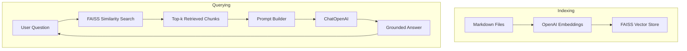

---

# ✅ **FINAL COMPLETE README.md (ONE FILE, ONE CODE BLOCK)**

````md
# LangChain LLM Demo


A small but powerful Python project demonstrating how to:

- Load environment variables with `python-dotenv`
- Call OpenAI’s models using **LangChain**
- Print model responses and token usage
- Estimate API cost for each call
- Run an **interactive chatbot with in-session memory**
- Perform **Retrieval-Augmented Generation (RAG)** over local documents
- Structure a simple, reproducible LLM project

It’s an ideal starting point for learning how LangChain and the OpenAI API work together.

---

## 🚀 Getting Started

Follow these steps to run the project from scratch on any machine.

---

### 1. Install Python 3.10+ (if needed)

Download from:  
https://www.python.org/downloads/

Make sure to check:

✔ **“Add Python to PATH”**

---

### 2. Clone the repository

```bash
git clone https://github.com/drzaheerabhatti-tech/langchain-llm-demo.git
cd langchain-llm-demo
````

---

### 3. Create and activate a virtual environment

#### Windows (PowerShell):

```bash
python -m venv venv
.\venv\Scripts\activate
```

#### macOS / Linux:

```bash
python3 -m venv venv
source venv/bin/activate
```

When active, your terminal will show:

```text
(venv)
```

---

### 4. Install project dependencies

```bash
pip install -r requirements.txt
```

---

### 5. Get an OpenAI API Key

#### 5.1 Sign in to OpenAI

[https://platform.openai.com/](https://platform.openai.com/)

#### 5.2 Create a secret API key

Go to:
**Dashboard → API Keys → Create new secret key**

Copy your key:

```text
sk-xxxxxxxxxxxxxxxxxxxxxxxxxxxxxxxx
```

> Keep it private — **never commit it to GitHub**.

#### 5.3 Create a `.env` file

In the project root, create a file named:

```text
.env
```

Add your key:

```env
OPENAI_API_KEY=sk-your-real-key-here
```

`.env` is **ignored** by Git (via `.gitignore`).

---

## 6. Basic LLM Demo (`llm.py`)

This script sends a **fixed prompt** to the model and shows:

* The reply
* Token usage
* Estimated cost

Run:

```bash
python llm.py
```

Example output:

```text
REPLY: Solace PubSub+ is a high-performance event streaming and messaging platform.
USAGE: {'input_tokens': 12, 'output_tokens': 16, 'total_tokens': 28}
Estimated cost for this call: $0.00001234
```

This is the minimal, “hello world” example.

---

# 💬 Chatbot with In-Session Memory (`llm_prompt.py`)

`llm_prompt.py` is a **mini personal chatbot** that remembers what you say during the session.

* Maintains a conversation history
* Uses `SystemMessage`, `HumanMessage`, `AIMessage`
* Shows usage + estimated cost per reply
* Lets you chat until you type `exit` / `quit`
* Allows an optional *first prompt* via command line

---

## ▶️ Run the chatbot

Activate venv if needed:

```bash
.\venv\Scripts\activate
```

Then:

```bash
python llm_prompt.py
```

You’ll see:

```text
💬 Mini Chatbot with Memory (gpt-4o-mini)
Type your message and press Enter.
Type 'exit' or 'quit' to end the chat.

You:
```

Example:

```text
You: Hi, who are you?
Assistant: I'm your friendly AI assistant, here to help with questions and ideas.

   🔎 usage: {'input_tokens': 32, 'output_tokens': 27}
   💰 cost for this reply: $0.0000xxxx
```

### Optional: start with a one-off prompt

```bash
python llm_prompt.py "Explain TLS in simple terms"
```

---

## 🧱 Chatbot Architecture

```mermaid
flowchart TD
    U[User] -->|messages| H[Conversation History]
    H -->|full history| LLM[ChatOpenAI (gpt-4o-mini)]
    LLM --> R[AI Reply]
    R -->|append| H
    R --> U
```

* The **history list** grows with each turn.
* The model receives the *entire* conversation so far.
* Memory resets when the script ends.

---

# 📚 Retrieval-Augmented Generation (RAG) Demo (`rag_demo.py`)

This demo shows how to answer questions based on **your own notes**, not just the LLM.

It performs:

* File loading
* Text chunking
* Embedding with `OpenAIEmbeddings`
* Vector storage in **FAISS**
* Semantic retrieval
* Answering with grounded context

Perfect for creating a “Chat with your notes” assistant.

---

## ▶️ Run the RAG demo

```bash
python rag_demo.py
```

You will see:

```text
RAG demo over your markdown notes.
Ask questions about Python or LangChain concepts.
Type 'exit' to quit.

Question (or 'exit'):
```

Example queries:

```
What is LangChain?
How does the estimate_cost function work?
What does load_dotenv() do?
```

---

## 🗂️ Documents used by RAG

By default, the demo loads:

* `PYTHON_CONCEPTS.md`
* `LANGCHAIN_CONCEPTS.md`

You can add more by editing:

```python
markdown_files = ["PYTHON_CONCEPTS.md", "LANGCHAIN_CONCEPTS.md"]
```

---

## 🧠 RAG Architecture



---

## 🔧 Extra dependencies for RAG

These are already included in `requirements.txt`, but listed for clarity:

```bash
pip install langchain-openai langchain-community faiss-cpu
```

---

# 📂 Project Structure

```
langchain-llm-demo/
│
├── llm.py                # Basic fixed-prompt example
├── llm_prompt.py         # Chatbot with in-session memory
├── rag_demo.py           # RAG demo using your markdown notes
│
├── PYTHON_CONCEPTS.md    # Python explanations for beginners
├── LANGCHAIN_CONCEPTS.md # LangChain explanations for beginners
│
├── requirements.txt      # Dependencies
├── README.md             # This file
├── .gitignore            # Excludes venv + .env
└── venv/                 # Virtual environment (ignored by Git)
```

---

# 📘 Learning Resources

* **Python Concepts** → `PYTHON_CONCEPTS.md`
* **LangChain Concepts** → `LANGCHAIN_CONCEPTS.md`
* OpenAI API → [https://platform.openai.com/docs](https://platform.openai.com/docs)
* LangChain Docs → [https://python.langchain.com/](https://python.langchain.com/)

---

# 🌱 Next Steps (Suggested Enhancements)

### 🚀 Combine Chatbot + RAG

A single assistant that:

* remembers conversation
* retrieves knowledge
* answers from your documents

### 💾 Persistent Memory

Save chat history between sessions.

### 🌐 Add a Web UI

Streamlit or FastAPI-based chatbot.

### 📊 Observability

Log token usage, latency, prompt structure.

### 🐳 Docker Support

Add a `Dockerfile` to containerize your assistant.

---

# 🙌 Summary

This project helps you learn:

* How to call LLMs with LangChain
* How to handle environment variables
* How to estimate token cost
* How to build a **chatbot with memory**
* How to build a **RAG system**
* How to structure a clean Python + Git project

```

---
