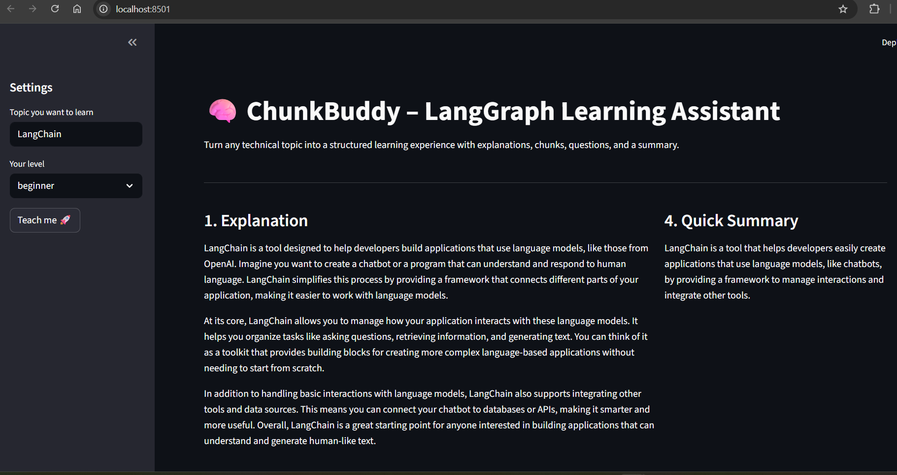
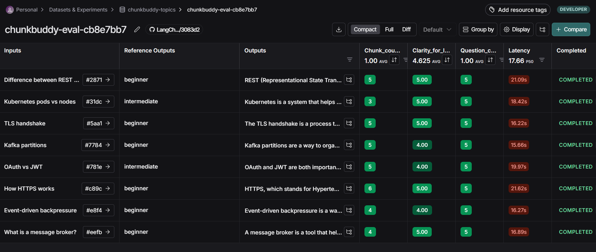

# 📘 ChunkBuddy: A LangGraph-Powered Learning Workflow

ChunkBuddy is an AI-powered learning assistant built using **LangGraph**, **LangChain**, and **LangSmith**.

It takes any technical topic and produces a structured, pedagogy-informed learning output:

- Level-appropriate explanation  
- Chunked learning sections  
- Retrieval-practice questions  
- A one-sentence Quick Summary  
- Meta-learning insights (chunking, cognitive load, pedagogy principles)

ChunkBuddy is designed to function like a learning companion — producing outputs grounded in cognitive science.

---

## 🚀 Goals

ChunkBuddy was designed to:

1. Demonstrate LangGraph through a realistic, multi-step agent  
2. Apply pedagogy principles (chunking, retrieval practice, cognitive load reduction)  
3. Showcase LangSmith evaluation and experiment tracking  
4. Provide a clean Streamlit UI for demos and exploration  

This creates a transparent, interpretable educational pipeline.


# ⚡ Quickstart

Follow these steps to run ChunkBuddy locally:

### 1. Clone the repository

```bash
git clone https://github.com/drzaheerabhatti-tech/langchain-llm-demo.git
cd langchain-llm-demo/agent_demo
```

### 2. Create and activate a virtual environment
```bash
python -m venv venv
source venv/bin/activate      # macOS/Linux
.\venv\Scripts\activate       # Windows
```
### 3. Install dependencies
```bash
pip install -r requirements.txt
```
### 4. Set your environment variables
```bash
Create a .env file in the agent_demo folder:
OPENAI_API_KEY=your-openai-key-here
LANGCHAIN_TRACING_V2=true
LANGCHAIN_API_KEY=your-langsmith-key-here
LANGCHAIN_PROJECT=chunkbuddy

⚠️ .env is already in .gitignore, so keys won’t be committed.
```
## 🔑 Environment Variable Loading (Important)

This project uses **load_env.py** to ensure environment variables load correctly from `.env`.

```
agent_demo/
    chunkbuddy_graph.py
    chunkbuddy_ui.py
    evaluate_chunkbuddy.py
    load_env.py
    .env
```

### 5. Run the LangGraph agent (CLI mode)
```bash
python chunkbuddy_graph.py
```
### 6. Launch the Streamlit UI
```bash
streamlit run chunkbuddy_ui.py
```
The Streamlit UI at http://localhost:8501

### 7. Run LangSmith Evaluation
```bash
python evaluate_chunkbuddy.py
```
LangSmith traces and evaluation results in your project dashboard (https://smith.langchain.com/)

### Workflow Architecture
```
          ┌───────────────────────┐
          │   Dataset:            │
          │   chunkbuddy-topics   │
          │  (topics + levels)    │
          └─────────┬─────────────┘
                    │
                    ▼
          ┌───────────────────────┐
          │   evaluate_chunkbuddy │
          │   (batch runner)      │
          │ - loads dataset       │
          │ - builds state        │
          │ - calls graph         │
          │ - applies evaluators  │
          └─────────┬─────────────┘
                    │
                    ▼
          ┌───────────────────────┐
          │   chunkbuddy_graph    │
          │   (LangGraph logic)   │
          │ - draft_explanation   │
          │ - chunk_explanation   │
          │ - generate_questions  │
          │ - summarize_and_meta  │
          └─────────┬─────────────┘
                    │
        ┌───────────┴───────────┐
        ▼                       ▼
┌───────────────────┐   ┌───────────────────────┐
│ LangSmith results │   │     chunkbuddy_ui     │
│ - clarity scores  │   │ - user enters topic   │
│ - chunk counts    │   │ - calls graph once    │
│ - question counts │   │ - shows explanation,  │
│ - latency metrics │   │   chunks, questions   │
└───────────────────┘   └───────────────────────┘
```
---
## 🧠 How ChunkBuddy Works

ChunkBuddy is implemented as a **Directed Acyclic Graph (DAG)** in LangGraph:

```
START
  ↓
draft_explanation
  ↓
chunk_explanation
  ↓
generate_check_questions
  ↓
summarize_and_meta
  ↓
END
```

Each node:

- Receives a partial state  
- Adds only the fields it owns  
- Returns updates  
- LangGraph merges them into global state  

This produces a modular, debuggable workflow.

---

## 🗂 Shared State Definition

A `TypedDict` defines the agent’s shared state:

```python
class LearningState(TypedDict, total=False):
    topic: str
    level: str
    raw_explanation: str
    chunks: List[str]
    check_questions: List[str]
    summary: str
    meta: dict
```

---

# 🔧 Node-by-Node Breakdown

### 🟦 `draft_explanation`

Generates a level-appropriate explanation.  
**Input:** `topic`, `level`  
**Output:** `raw_explanation`

---

### 🟩 `chunk_explanation`

Splits the explanation into digestible cognitive units.  
**Input:** `raw_explanation`  
**Output:** `chunks`

*Cognitive principle:* **Chunking reduces cognitive load.**

---

### 🟧 `generate_check_questions`

Creates retrieval-practice questions.  
**Input:** `chunks`  
**Output:** `check_questions`

*Cognitive principle:* **Retrieval practice strengthens learning.**

---

### 🟥 `summarize_and_meta`

Creates a quick summary + meta-learning notes.  
**Input:** topic, chunks, questions  
**Output:** `summary`, `meta`

---

# 🔄 Graph Construction

```python
graph = StateGraph(LearningState)

graph.add_node("draft_explanation", draft_explanation)
graph.add_node("chunk_explanation", chunk_explanation)
graph.add_node("generate_check_questions", generate_check_questions)
graph.add_node("summarize_and_meta", summarize_and_meta)

graph.add_edge(START, "draft_explanation")
graph.add_edge("draft_explanation", "chunk_explanation")
graph.add_edge("chunk_explanation", "generate_check_questions")
graph.add_edge("generate_check_questions", "summarize_and_meta")
graph.add_edge("summarize_and_meta", END)

app = graph.compile()
```

---

# 🖥️ Streamlit UI


## UI Features

- Enter any learning topic  
- Pick your learning level  
- Display:
  - Explanation  
  - Expandable chunks  
  - Retrieval questions  
  - Quick summary  
  - Meta-learning insights  
- Developer Mode (optional) to view raw state  

Run the UI:

```bash
streamlit run chunkbuddy_ui.py
```
---

# 🧪 LangSmith Evaluation Experiments

ChunkBuddy includes an automated evaluation script:

```bash
python evaluate_chunkbuddy.py
```
Every graph run appears as a full trace in LangSmith:

- Node-by-node execution  
- State transitions  
- Prompts and outputs  
- Latency and token cost  

This provides deep observability for debugging complex agent workflows.

Evaluators used:

| Evaluator | Purpose |
|----------|---------|
| `chunk_count_ok` | Ensures chunk list is 3–7 |
| `question_count_ok` | Ensures question count is reasonable |
| `clarity_for_level` | LLM-as-judge clarity evaluation |

This runs:

- Dataset loading (`chunkbuddy-topics`)
- Graph execution for each test case
- LangSmith experiment logging  
- Automatic scoring and reporting

---

# 📊 LangSmith Results Summary & Interpretation

Traces appear in LangSmith under project: **chunkbuddy**

### 📸 Experiment Screenshot


### Key Takeaways

✔️ **Chunk count stable (5 chunks in most runs)**  
→ Chunking prompt is predictable and well calibrated.

✔️ **Questions consistently generated (4–5 questions)**  
→ Strong, reliable retrieval-question generation.

✔️ **High clarity scores from LLM-as-judge**  
→ Explanations match beginner-level requirements.

✔️ **Zero failures**  
→ The DAG is robust. Each node returns correct partial updates without breaking the state.

Overall, this shows **high workflow consistency** across topics and levels.

---

# 🧭 What I Learned

- LangGraph partial-state updates keep node logic clean  
- TypedDict-based state makes debugging easy  
- LangSmith traces dramatically accelerate troubleshooting  
- Streamlit is a fast way to demo LangGraph apps  
- LangGraph + LangSmith is a strong developer experience combo  

---

# 🎯 Summary

ChunkBuddy demonstrates:

- A clear multi-step LangGraph workflow  
- LLM-powered explanation, chunking, questioning, summarization  
- A polished Streamlit interface  
- Full LangSmith trace + evaluation  
- Cognitive-science-aligned learning design  

A strong foundation for building advanced tutoring or reasoning agents.

---

# 🧪 Why I Chose This Agent Design

A learning assistant naturally forms a **multi-step pipeline**:

**explain → chunk → question → summarize**

This makes it:

- Easy to reason about  
- Perfect for LangGraph DAG structure  
- Rich enough for LangSmith evaluation  
- Useful as an educational tool  

The result demonstrates real-world use of both LangGraph and LangSmith.

